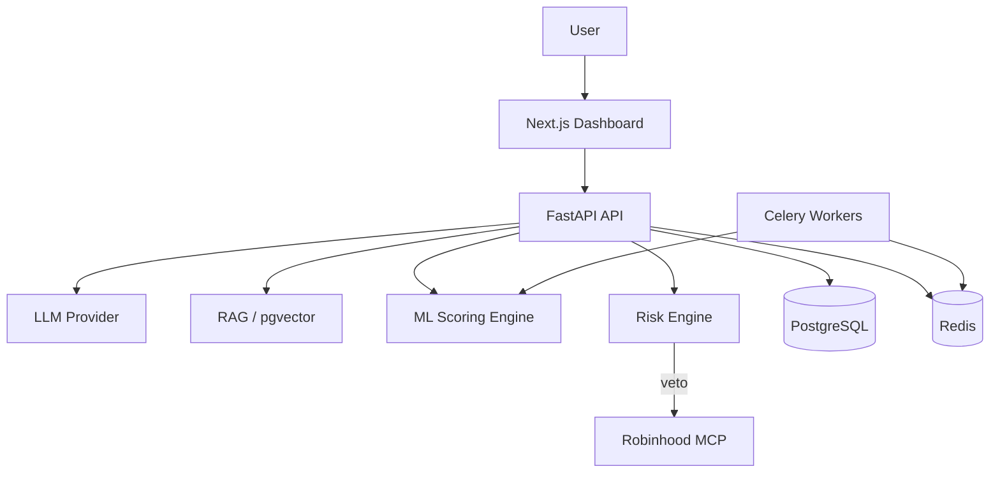

# Architecture

## System diagram

## Agent roles

| Agent | Responsibility |
|-------|----------------|
| **Orchestrator** | Parses intent, routes to services, formats response |
| **Market** | SPY, QQQ, VIX, sector ETFs (Phase 2) |
| **Stock** | Per-ticker features and scores |
| **News** | Sentiment from headlines (Phase 2) |
| **ML** | Direction/volatility models |
| **Risk** | Hard rules — **veto power** |
| **Portfolio** | Exposure, correlation, concentration |
| **Execution** | MCP order preview/place (Phase 3) |
| **Journal** | Trade log and outcomes (Phase 2) |

## Phase 1 (current)

- Demo portfolio + deterministic feature scoring
- Keyword RAG over risk playbooks
- Risk engine with CAUTION / BLOCK / ALLOW
- Chat API without live MCP execution

## Phase 2

- Live market data (Polygon/FRED)
- pgvector RAG ingestion
- Celery async feature refresh
- Paper trade journal

## Phase 3

- Robinhood MCP live connection
- Order preview + manual approval UI
- Small Agentic account execution
