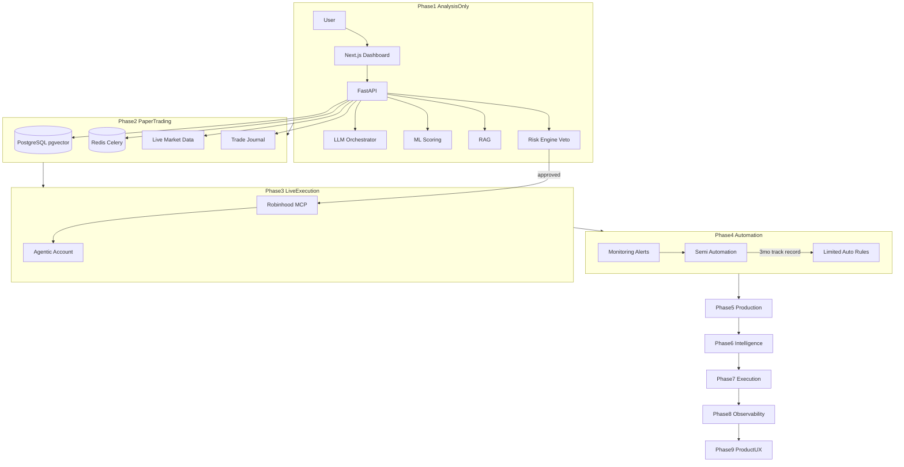
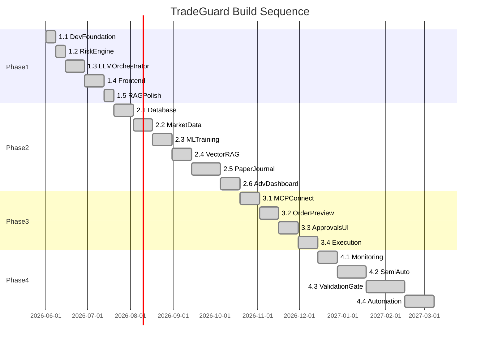
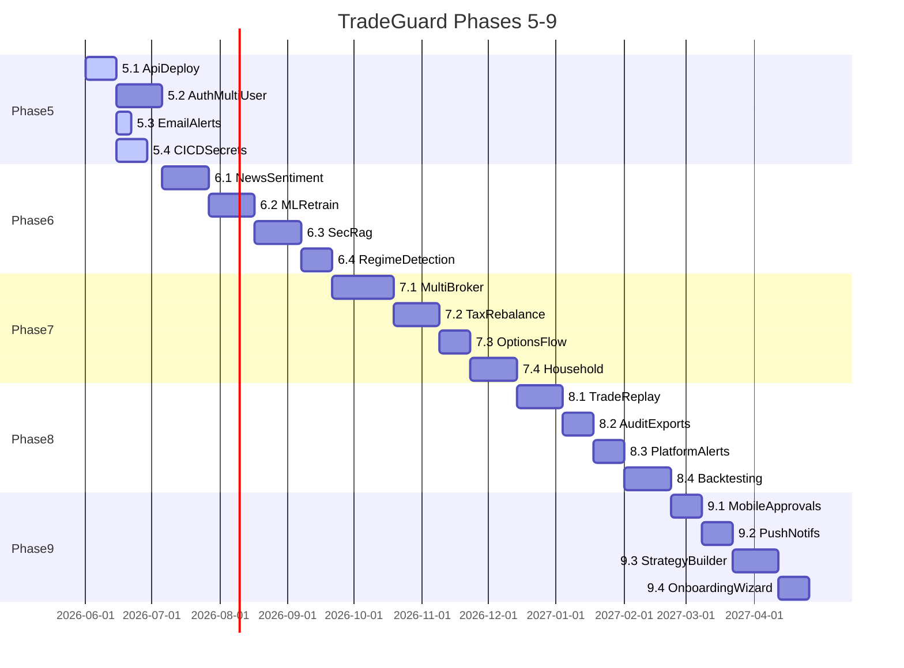

# TradeGuard AI — Complete Phased Build Plan

> Living roadmap for TradeGuard AI. Update status as sub-phases ship.

## Vision

TradeGuard AI is **not an auto-trader**. It is an AI risk manager that orchestrates analysis, applies hard-coded guardrails with veto power, and only later connects to Robinhood MCP for guarded execution.

---

## Implementation Status (June 2026)

| Phase | Status | Notes |
|-------|--------|-------|
| **Phase 1** — Analysis only | **Done** | Risk engine, LLM orchestrator, dashboard, RAG, ticker analysis |
| **Phase 2** — Paper trading | **Done** | Mock-first providers, journal, pgvector RAG, advanced risk dashboard |
| **Phase 3** — Guarded execution | **Done** | MCP layer, execution flow, approvals UI at `/approvals` |
| **Phase 4.1** — Monitoring & alerts | **Done** | PnL monitoring, auto-halt, Slack alerts (mock-first) |
| **Phase 4.2** — Semi-auto strategies | **Done** | Pre-defined rules, ALLOW-only auto-approve, `/strategies` UI |
| **Phase 4.3** — Validation gate | **Done** | Sharpe, drawdown, win rate report; blocks automation until pass |
| **Phase 4.4** — Constrained automation | **Done** | Master kill switch, daily caps, ALLOW-only, audit trail |
| **Phase 5.1** — API deploy | **Done** | Dockerfile, Railway/Fly, `/health/ready`, [DEPLOY.md](./DEPLOY.md) |
| **Phase 5.2** — Auth & multi-user | **Done** | Clerk optional, User model, JWT middleware, per-user scoping |
| **Phase 5.3** — Email alerts | **Done** | SMTP provider, composite Slack+email dispatch |
| **Phase 5.4** — CI/CD & secrets | **Done** | Staging workflow, Docker CI, deploy docs |
| **Phase 6.1** — News / sentiment | **Done** | Mock + Polygon news, sentiment in features & chat |
| **Phase 6.2** — ML retrain | **Done** | Journal-augmented retrain, versioning, `/api/intelligence/ml` |
| **Phase 6.3** — SEC filing RAG | **Done** | Mock 10-K summaries indexed into pgvector RAG |
| **Phase 6.4** — Regime detection | **Done** | VIX/macro regime, score adjustment, dashboard widget |
| **Phase 7** — Execution expansion | **Planned** | Multi-broker, tax-aware rebalance, options, households |
| **Phase 8** — Observability | **Planned** | Trade replay, audit exports, drift alerts, backtesting |
| **Phase 9** — Product & UX | **Planned** | Mobile approvals, push, strategy builder, onboarding |

**Provider pattern:** All external services use `auto` mode — mock when no API key, live when configured. Swap keys at the end; no code changes required.

| Service | Mock (default) | Live (add key) | Env var |
|---------|----------------|----------------|---------|
| Market data | `MockMarketDataProvider` | Polygon | `POLYGON_API_KEY` |
| Embeddings / RAG | `MockEmbeddingProvider` | OpenAI | `OPENAI_API_KEY` |
| MCP / execution | `MockRobinhoodMCPClient` | Live MCP SDK | `ROBINHOOD_MCP_URL` |
| Alerts | `MockAlertProvider` | Slack + SMTP email | `SLACK_WEBHOOK_URL`, `SMTP_*` |
| Auth | Disabled (demo user) | Clerk JWT | `CLERK_SECRET_KEY` |
| Storage | File-backed memory | PostgreSQL + pgvector | `docker compose up -d` |
| API hosting | Local uvicorn | Railway / Fly.io | See [DEPLOY.md](./DEPLOY.md) |

---

## Phase 1 — Analysis Only (no execution)

**Goal:** User can chat with TradeGuard, see portfolio risk, sector exposure, ticker analysis, and CAUTION/BLOCK verdicts — all on demo data. No orders placed.

| Sub-phase | Description | Status |
|-----------|-------------|--------|
| **1.1** Dev foundation | CORS, env templates, health indicator, Docker Compose | Done |
| **1.2** Risk engine | Enforce all rules, real features in preview, unit tests | Done |
| **1.3** LLM orchestrator | OpenAI/Anthropic, tool routing, trade intent parsing | Done |
| **1.4** Frontend | Portfolio, dashboard, sidebar, chat wiring | Done |
| **1.5** RAG + analysis | Expanded playbooks, ticker analysis UI | Done |

**Gate:** End-to-end demo without MCP or live market data. ✅

---

## Phase 2 — Paper Trading and Live Intelligence

**Goal:** Replace demo data with real market feeds, persist state, build a 100-trade paper journal, and upgrade RAG to vector search.

| Sub-phase | Description | Status |
|-----------|-------------|--------|
| **2.1** Database & persistence | SQLAlchemy models, pgvector, storage abstraction | Done |
| **2.2** Live market data | Polygon provider + mock fallback, Celery refresh | Done |
| **2.3** ML training | Direction model bootstrap, scoring pipeline | Done |
| **2.4** Vector RAG | Mock/live embeddings, pgvector search | Done |
| **2.5** Paper trade journal | Journal API + UI at `/journal` | Done |
| **2.6** Advanced risk dashboard | VaR, correlation, stress tests | Done |

**Gate:** 100 paper trades logged; live data flowing when keys set. ✅ (mock mode works without keys)

---

## Phase 3 — Small Agentic Account (manual approval)

**Goal:** Connect Robinhood MCP, read live Agentic account portfolio, preview orders, and execute only after explicit user approval.

| Sub-phase | Description | Status |
|-----------|-------------|--------|
| **3.1** MCP client | Mock + live clients, portfolio/quotes | Done |
| **3.2** Order preview | Risk gate → MCP preview, execution API | Done |
| **3.3** Manual approval UI | `/approvals` queue, approve/reject | Done |
| **3.4** Guarded execution | place_order with approval, journal auto-log | Done |

**Gate (before live Phase 4):**
- Separate Agentic account funded ($500–$1,000)
- 3+ months of live manual-approved trades with documented results
- Zero options automation; daily loss circuit breaker tested

---

## Phase 4 — Limited Automation (post-validation)

**Goal:** After proven track record, allow selective automation — still no options, still risk-engine veto, still small position sizes.

### Phase 4.1 — Monitoring and alerting *(done)*

- Real-time PnL monitoring, daily loss circuit breaker (auto-halt trading)
- Slack/email alerts on BLOCK events, large drawdowns, MCP failures
- Monitoring dashboard at `/monitoring`
- **Exit criteria:** Trading halts automatically when daily loss limit hit ✅

### Phase 4.2 — Semi-automated trade plans *(done)*

- User defines approved strategies (e.g. "rebalance QQQ if tech exposure > 25%")
- Agent proposes trades; risk engine evaluates; user can opt into auto-approve for pre-defined rules only
- Strategies UI at `/strategies`
- **Exit criteria:** One strategy runs with auto-approve for ALLOW-only rebalancing ✅

### Phase 4.3 — Performance validation gate *(done)*

- Require 3+ months positive risk-adjusted returns from Phase 3 journal
- Automated report: Sharpe, max drawdown, win rate, rule violation count
- Validation UI at `/validation`
- **Exit criteria:** Gate blocks Phase 4.4 until metrics pass configured thresholds ✅

### Phase 4.4 — Constrained automation *(done)*

- Auto-execute only ALLOW verdicts within pre-approved strategy bounds
- Hard caps remain: no options, max position size, sector limits, manual override always available
- Master kill switch at `/automation` — disable instantly
- Full audit trail in automation log + journal
- **Exit criteria:** Automation can be disabled instantly; full audit trail in journal ✅

---

## Build Sequence

**Phases 1–4 complete.** Phase 5+ in progress — see below.

---

## Phase 5 — Production Hardening *(in progress)*

**Goal:** Run TradeGuard in production with managed Postgres/Redis, authenticated users, reliable alerts, and safe CI/CD.

| Sub-phase | Description | Status |
|-----------|-------------|--------|
| **5.1** API deploy | Dockerfile, Railway + Fly configs, `/health/ready`, [DEPLOY.md](./DEPLOY.md) | Done |
| **5.2** Auth & multi-user | Clerk (optional), User model, JWT middleware, per-user journal/portfolio | Done |
| **5.3** Email alerts | SMTP provider, composite multi-channel dispatch | Done |
| **5.4** CI/CD & secrets | Staging branch deploy, Docker build in CI, secrets checklist | Done |

**Gate:** API reachable on Railway/Fly with Postgres + Redis; Vercel frontend talks to prod API; alerts fire on Slack and/or email.

---

## Phase 6 — Intelligence Upgrades *(done)*

**Goal:** Smarter analysis — news, retrained models, richer RAG, macro-aware risk.

| Sub-phase | Description | Status |
|-----------|-------------|--------|
| **6.1** News / sentiment agent | Headline ingestion, ticker sentiment scores, chat tool | Done |
| **6.2** ML retraining on journal | Periodic retrain from filled trades; model versioning | Done |
| **6.3** SEC filing RAG | EDGAR ingestion, chunk + embed 10-K/10-Q summaries | Done |
| **6.4** Regime detection | VIX/macro features in risk scoring; regime labels in dashboard | Done |

**Gate:** Ticker analysis cites news + filings; risk score adjusts in high-VIX regimes. ✅

---

## Phase 7 — Execution & Portfolio Expansion *(planned)*

**Goal:** Beyond single Robinhood Agentic account — more brokers, tax logic, controlled options, households.

| Sub-phase | Description | Status |
|-----------|-------------|--------|
| **7.1** Multi-broker abstraction | Broker adapter interface; Robinhood MCP as first impl | Planned |
| **7.2** Tax-aware rebalancing | Lot tracking, wash-sale awareness in strategy proposals | Planned |
| **7.3** Options workflow | Mandatory manual approval path; stricter risk caps | Planned |
| **7.4** Multi-account / household | Link multiple accounts; aggregated exposure view | Planned |

**Gate:** Household dashboard shows combined exposure; options require explicit approval every time.

---

## Phase 8 — Observability & Compliance *(planned)*

**Goal:** Auditability, incident response, and strategy validation before live capital.

| Sub-phase | Description | Status |
|-----------|-------------|--------|
| **8.1** Trade replay & post-mortem | Timeline UI per trade; decision → risk → execution chain | Planned |
| **8.2** Regulatory-style audit exports | CSV/JSON export of journal, approvals, automation log | Planned |
| **8.3** Platform alerting | MCP failure, API latency, model drift alerts | Planned |
| **8.4** Journal backtesting | Replay strategies against historical journal entries | Planned |

**Gate:** One-click export of 90-day audit trail; backtest report for any strategy.

---

## Phase 9 — Product & UX *(planned)*

**Goal:** Production-grade UX for operators approving trades on the go.

| Sub-phase | Description | Status |
|-----------|-------------|--------|
| **9.1** Mobile-friendly approvals | Responsive `/approvals`; touch-first approve/reject | Planned |
| **9.2** Push notifications | Web push for BLOCK / halt / pending approval | Planned |
| **9.3** Visual strategy builder | Rule builder UI replacing raw JSON config | Planned |
| **9.4** Agentic onboarding wizard | Step-by-step MCP connect, fund account, set limits | Planned |

**Gate:** Approve a trade from mobile; complete onboarding without reading MCP-SETUP.md.

---

## Build Sequence (Phases 5–9)

---

## Default Risk Guardrails (all phases)

Configured in `apps/api/app/risk/rules.py` — never weaken without explicit gate approval:

- Max single-name exposure: 20%
- Max tech sector exposure: 30%
- Max trade size: $250
- Max daily loss: $50
- Allowed tickers: NVDA, MSFT, META, TSLA, QQQ, GBTC
- No options without manual approval
- Limit orders only for volatile tickers

---

## Key Files

| Area | Path |
|------|------|
| Architecture | [docs/ARCHITECTURE.md](./ARCHITECTURE.md) |
| MCP setup | [docs/MCP-SETUP.md](./MCP-SETUP.md) |
| Risk engine | `apps/api/app/risk/engine.py` |
| Execution | `apps/api/app/services/execution.py` |
| Monitoring | `apps/api/app/services/monitoring.py` |
| Strategies | `apps/api/app/services/strategies.py` |
| Validation | `apps/api/app/services/validation.py` |
| Automation | `apps/api/app/services/automation.py` |
| Web dashboard | `apps/web/src/app/` |
| Deployment | [docs/DEPLOY.md](./DEPLOY.md) |
| Auth | `apps/api/app/core/auth.py` |
| Intelligence / news | `apps/api/app/services/news.py` |
| SEC filings RAG | `apps/api/app/services/sec_filings.py` |
| Regime detection | `apps/api/app/services/regime.py` |
| ML retrain | `apps/api/app/services/ml_retrain.py` |
| Docker / Railway | `apps/api/Dockerfile`, `apps/api/railway.toml` |
