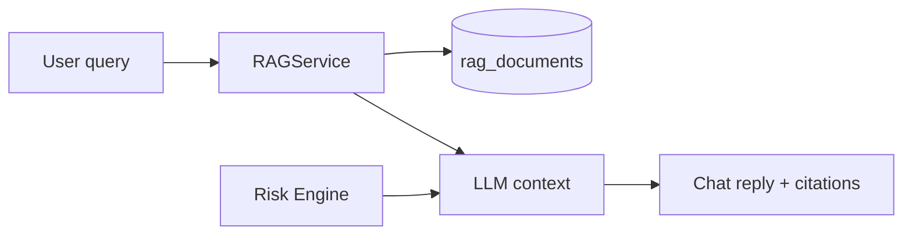

# RAG Phased Roadmap

> Step-by-step plan to strengthen TradeGuard's retrieval layer. Update status as each sub-phase ships.

## Architecture reminder

RAG **grounds the LLM** — it does not override the risk engine. The risk engine always has veto power.

---

## Phase 1 — Retrieval foundations *(done)*

**Goal:** Fast, accurate search over the existing corpus with ticker-aware context and visible citations.

| Step | Description | Status |
|------|-------------|--------|
| **1.1** | Native pgvector cosine search (replace Python loop) | Done |
| **1.2** | HNSW index on `rag_documents.embedding` | Done |
| **1.3** | Ticker-aware query enrichment + metadata filter | Done |
| **1.4** | Inject all top-k chunks into LLM context (not just first) | Done |
| **1.5** | Return `rag_sources` in chat API with source + score | Done |
| **1.6** | Structured metadata (`type`, `ticker`) on all documents | Done |

**Gate:** Chat cites 3 playbook/filing sources; `/analysis` unchanged; tests pass.

---

## Phase 2 — Richer corpus *(done)*

**Goal:** Replace static mocks with real, growing knowledge.

| Step | Description | Status |
|------|-------------|--------|
| **2.1** | Markdown playbook ingestion from `docs/playbooks/` | Done |
| **2.2** | Real SEC EDGAR fetch + section chunking (Risk Factors, MD&A) | Done |
| **2.3** | Periodic news headline indexing per ticker | Done |
| **2.4** | Celery task to refresh RAG index on schedule | Done |

**Gate:** NVDA analysis cites a real 10-K excerpt; playbooks editable without code changes.

---

## Phase 3 — Smarter retrieval *(done)*

**Goal:** Better recall and precision as the corpus grows.

| Step | Description | Status |
|------|-------------|--------|
| **3.1** | Hybrid search (vector + keyword/BM25) | Done |
| **3.2** | Query rewriting before embedding | Done |
| **3.3** | Rerank top-20 candidates → top-3 | Done |
| **3.4** | Recency decay for news/filings | Done |
| **3.5** | Separate retrieval by doc type (playbook vs filing vs news) | Done |

**Gate:** "wash sale" and "VIX rising" queries retrieve correct chunks reliably.

---

## Phase 4 — Agentic RAG *(done)*

**Goal:** LLM decides when and what to retrieve; personalized knowledge.

| Step | Description | Status |
|------|-------------|--------|
| **4.1** | RAG tools: `search_playbooks`, `search_filings`, `search_journal` | Done |
| **4.2** | Index closed trade post-mortems from journal | Done |
| **4.3** | Per-user journal RAG namespace | Done |
| **4.4** | Citations UI in chat widget | Done |

**Gate:** Agent retrieves filings only when user asks about fundamentals; journal cited on repeat mistakes.

---

## Phase 5 — Ingestion pipeline & richer retrieval *(in progress)*

**Goal:** Reliable ingestion with dedupe, type-specific chunking, partial reindex, and metadata enrichment.

| Step | Description | Status |
|------|-------------|--------|
| **5.1** | Unified `RAGIngestPipeline` (normalize → chunk → hash dedupe → embed → upsert) | Done |
| **5.2** | Type-specific chunkers (playbook, filing, news) | Done |
| **5.3** | Partial reindex API `POST /rag/refresh/{source}` | Done |
| **5.4** | pg_trgm + meta JSONB indexes | Done |
| **5.5** | Per-doc-type embedding model + version in meta | Done |
| **5.6** | Index analysis snapshots + ML runs (event hooks) | Done |
| **5.7** | QueryPlan router + structured agent tools | Done |
| **5.8** | Eval pipeline + citation grounding | Done |

---

## Phase 6 — Retrieval hardening *(done)*

**Goal:** Postgres-native keyword search, SQL ACL, retrieval-quality eval, richer citations.

| Step | Description | Status |
|------|-------------|--------|
| **6.1** | `content_tsv` + `keyword_search_rag()` (tsvector + pg_trgm fallback) | Done |
| **6.2** | SQL-level ACL + doc_type filters in `search_rag` | Done |
| **6.3** | Retrieval recall in golden eval (`must_contain_phrases`) | Done |
| **6.4** | Trade-intent playbook quota + retrieval trace with scores | Done |
| **6.5** | Rich chunk metadata + UI source dates | Done |

**Gate:** Keyword search avoids full-corpus scan; golden eval reports `retrieval_recall_pct`; trade queries include playbook context.

---

## Phase 7 — Quality and freshness *(done)*

**Goal:** Section-aware filings, fresh news, regime context, optional cross-encoder rerank.

| Step | Description | Status |
|------|-------------|--------|
| **7.1** | Parent-child filing context expansion via `parent_id` | Done |
| **7.2** | Mock cross-encoder reranker (`providers/reranker/`) | Done |
| **7.3** | News TTL eviction (Celery daily job) | Done |
| **7.4** | `regime_snapshot` indexer + `search_regime` tool | Done |
| **7.5** | `search_news` tool + routing hints | Done |
| **7.6** | Staleness labels + hard cutoff for "today" news queries | Done |
| **7.7** | Weekly drift job (golden MRR vs baseline, alert if drop >15%) | Done |

**Gate:** Filing hits include section headers; "today" news never cites chunks >7 days old.

---

## Phase 8 — Scale and intelligence *(done)*

**Goal:** Cache hot queries, classifier fallback, research mode, online feedback loop.

| Step | Description | Status |
|------|-------------|--------|
| **8.1** | Per-`doc_type` partial indexes (Alembic migration) | Done |
| **8.2** | Query embedding + result LRU cache (invalidated on reindex) | Done |
| **8.3** | Classifier fallback when `infer_rag_tools()` returns `[]` | Done |
| **8.4** | Read-only `POST /api/chat/research` multi-tool loop | Done |
| **8.5** | Feedback stores `rag_chunk_ids`; thumbs-down feeds eval backlog | Done |
| **8.6** | Dedicated vector DB | Deferred (>500K chunks) |

**Gate:** Repeated queries hit cache; ambiguous queries still retrieve playbooks; research endpoint returns diversified chunks.

---

## Key files

| Area | Path |
|------|------|
| RAG service | `apps/api/app/rag/service.py` |
| RAG indexer | `apps/api/app/rag/indexer.py` |
| Playbook loader | `apps/api/app/rag/playbooks.py` |
| SEC EDGAR | `apps/api/app/providers/sec/edgar.py` |
| RAG Celery task | `apps/api/app/tasks/rag.py` |
| Hybrid retrieval | `apps/api/app/rag/retrieval.py` |
| RAG tools | `apps/api/app/rag/tools.py` |
| Journal RAG index | `apps/api/app/rag/journal_index.py` |
| Storage search | `apps/api/app/db/storage.py` |
| Chat orchestrator | `apps/api/app/agents/orchestrator.py` |
| SEC filings | `apps/api/app/services/sec_filings.py` |
| Chat API | `apps/api/app/api/routes/chat.py` |
| Config | `apps/api/app/core/config.py` |

---

## Config

| Env / setting | Default | Purpose |
|---------------|---------|---------|
| `RAG_TOP_K` | `3` | Chunks injected into LLM context |
| `RAG_PLAYBOOKS_DIR` | *(auto)* | Override path to `docs/playbooks/` |
| `RAG_NEWS_INDEX_ENABLED` | `true` | Index headlines into RAG |
| `RAG_REFRESH_INTERVAL_MINUTES` | `360` | Celery beat interval for full refresh |
| `SEC_EDGAR_ENABLED` | `true` | Fetch live 10-K from EDGAR (mock fallback) |
| `SEC_EDGAR_USER_AGENT` | — | Required by SEC — set your contact email |
| `OPENAI_API_KEY` | — | Live embeddings (mock when unset) |
| `SEC_FILINGS_ENABLED` | `true` | Index SEC summaries at startup |
| `RAG_HYBRID_SEARCH_ENABLED` | `true` | Fuse vector + keyword ranks (RRF) |
| `RAG_KEYWORD_SEARCH_ENABLED` | `true` | Postgres tsvector keyword leg (falls back to in-memory scan) |
| `RAG_QUERY_REWRITE_ENABLED` | `true` | Expand domain terms before embedding |
| `RAG_TYPE_ROUTING_ENABLED` | `true` | Route queries to playbook/filing/news |
| `RAG_CANDIDATE_POOL` | `20` | Candidates before rerank → top-k |
| `RAG_RERANKER_ENABLED` | `true` | Cross-encoder rerank (mock provider) |
| `RAG_NEWS_TTL_DAYS` | `30` | Delete news chunks older than N days |
| `RAG_NEWS_TODAY_MAX_AGE_DAYS` | `7` | Max news age for "today" queries |
| `RAG_QUERY_CACHE_ENABLED` | `true` | LRU cache for embeddings + results |
| `RAG_RESEARCH_MODE_ENABLED` | `true` | Multi-round research retrieval |
| `RAG_DRIFT_ALERT_PCT` | `15` | Alert when retrieval recall drops vs baseline |
